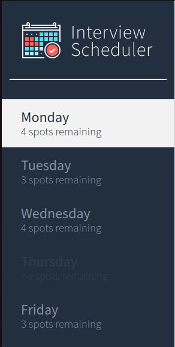
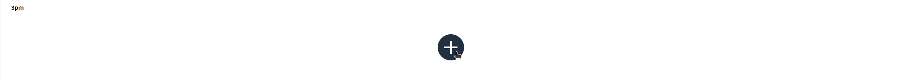
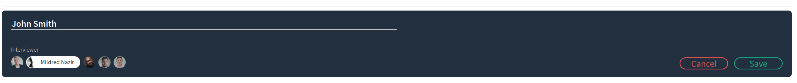
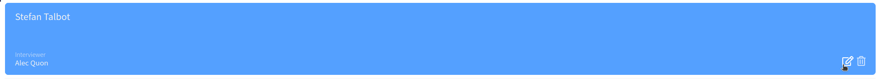
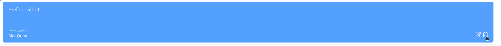
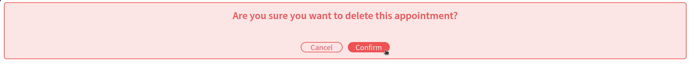

<!-- PROJECT LOGO -->
<div align="center">


---

<div align="center">
  A single page web app where users can schedule and manage interviews.
  <div>
    <a href="https://github.com/TeaBizzy/scheduler/issues">Report Bug</a>
    ·
    <a href="https://github.com/TeaBizzy/scheduler/issues">Request Feature</a>
  </div>
</div>
<br />

<!-- ABOUT THE PROJECT -->
## About The Project

<br />

### Built With

<a href="https://reactjs.org/">React</a> : 
<a href="https://sass-lang.com/">Sass</a> : 
<a href="https://jestjs.io/">Jest</a> :
<a href="https://go.cypress.io/">Cypress</a> :
<a href="https://storybook.js.org/">Storybook</a>


<div align="left">

---

<!-- GETTING STARTED -->
## Getting Started

### Prerequisites

* npm
* node

### Installation

1. Clone the repo
   ```sh
   git clone https://github.com/TeaBizzy/scheduler.git
   ```
2. Install NPM packages
   ```sh
   npm install
   ```
3. Running the Webpack development server
   ```sh
   npm start
   ```
4. Running the Jest test framework
   ```sh
   npm test
   ```
5. Running the Storybook visual testbed
   ```sh
   npm run storybook
   ```

### Accessing the Website

1. The website should launch with `npm start`. If you need to access it in the browers, enter the following url:
   ```
   http://localhost:8000/
   ```

---
<!-- USAGE EXAMPLES -->
## Usage

### Change Day
* Click the desired day on the left side panel.

  

---

### Create Interview

* Click the + icon on the available time slot you wish to schedule an interview for.

  

* Enter the students name, and select the desired interviewer, then click save. If you wish to not create an interview, click the cancel button.

  

---

### Editing an Interview

* Once an interview is created you can edit it by hovering over the interview, and clicking the edit button.

  

* You can now edit the form just like we did for creating a new interview. Clicking save will save the changes, and cancel will discard any changes made.

  

---

### Deleting an Interview

* Once an interview is created you can delete it by hovering over the interview, and clicking the delete button.

  

* You will be asked to confirm your choice, clicking confirm will permanently remove the interview.

  

---

<!-- CONTACT -->
## Contact

Stefan Talbot - https://github.com/TeaBizzy<br>

Project Link: [https://github.com/TeaBizzy/scheduler](https://github.com/TeaBizzy/scheduler)

---

<!-- ACKNOWLEDGMENTS -->
## Acknowledgments

* [Light House Labs](https://www.lighthouselabs.ca/)
